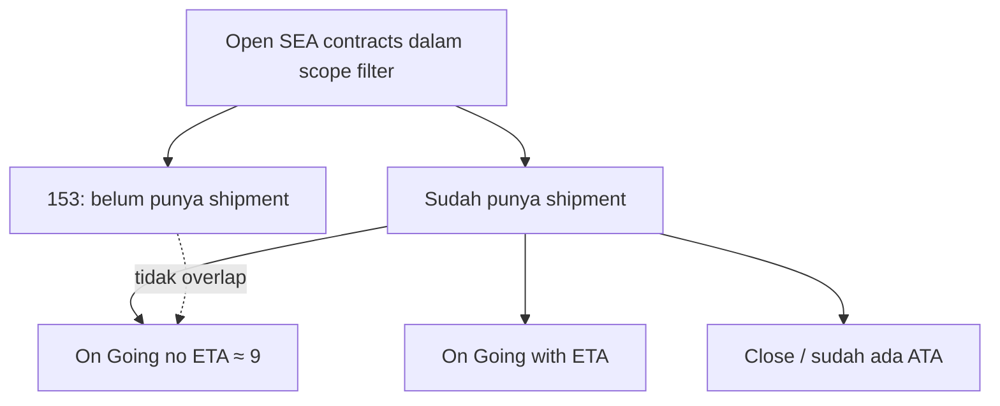

# Analisis: Kontrak Without Shipment vs Shipping Performance On Going (no ETA)

Dokumen ini merangkum hasil analisis perbandingan angka di halaman **Contracts** dan **Shipping Performance**, serta cara membedakan kontrak yang belum vs sudah punya shipment.

**Tanggal analisis:** Juni 2026  
**Contoh angka observasi:** Contracts `SEA contracts without shipments: 153` vs Shipping Performance `On Going (no ETA): 9 Contract`

---

## 1. Ringkasan eksekutif

Kedua angka **tidak seharusnya sama** karena mengukur **tahap berbeda** dalam alur logistik:

| Metrik | Pertanyaan bisnis |
|--------|-------------------|
| **Contracts — SEA without shipments** | Kontrak SEA Open yang **belum punya shipment sama sekali** di KLIP |
| **Shipping Performance — On Going (no ETA)** | Kontrak yang **sudah punya shipment**, masih ongoing, dan **belum ada ETA** |

- **153** = kontrak yang perlu **dibuatkan shipment** (planning gap).
- **9** = kontrak yang shipment-nya sudah ada, tapi **ETA belum diisi** (operational gap).

Tidak ada overlap langsung: kontrak tanpa shipment tidak bisa masuk Shipping Performance On Going.

---

## 2. Perbandingan definisi

### 2.1 Contracts — `SEA contracts without shipments`

| Aspek | Detail |
|-------|--------|
| **Halaman** | `/contracts` — kartu summary Section 1 |
| **API** | `GET /contracts/unassigned-counts` |
| **Filter tabel** | `GET /contracts?unassigned=sea` |
| **Unit hitung** | Kontrak (unik per `contract_id`) |
| **Status kontrak** | Hanya **Open / Active** |
| **Transport mode** | `SEA%` (effective transport mode) |
| **Syarat shipment** | `NOT EXISTS` baris di tabel `shipments` untuk `contract_id` kontrak |
| **Syarat ETA** | Tidak relevan (belum ada shipment) |
| **Scope toolbar** | Contract date, product, incoterm, plant, search, B2B flag, transport mode |
| **Eksklusi** | Kontrak B2B dengan `contract_reference_po` terisi |

**Logika SQL inti** (`backend/src/controllers/contract.controller.ts`):

```sql
WHERE UPPER(TRIM(effective_transport_mode)) LIKE 'SEA%'
  AND NOT EXISTS (SELECT 1 FROM shipments s WHERE s.contract_id = f.id)
```

**Tujuan bisnis:** alert planning — kontrak SEA Open yang belum di-assign ke vessel/shipment.

---

### 2.2 Shipping Performance — `On Going (no ETA)`

| Aspek | Detail |
|-------|--------|
| **Halaman** | `/shipping-performance` — kartu summary Section 1 |
| **API** | `GET /shipping-performance` (rows + agregasi di frontend) |
| **Unit hitung** | Kontrak (agregasi dari baris shipment) |
| **Syarat shipment** | **Harus ada** baris di `shipments` (`INNER JOIN`) |
| **Transport mode** | `SEA` atau `MIX` |
| **Filter SAP** | Shipment harus ter-link SAP dengan **STO Type = 'V'** |
| **Syarat ETA** | Semua field ETA loading + discharge kosong pada baris shipment |
| **Syarat ATA** | Kontrak **belum punya ATA** di shipment manapun (jika sudah ada ATA → masuk kartu **Close**) |
| **Scope toolbar** | Contract date, status shipment, product, incoterm, plant, vessel |

**Logika kartu** (`frontend/src/app/shipping-performance/page.tsx`):

- **On Going (with ETA):** minimal 1 shipment open dengan ETA, tanpa ATA di kontrak.
- **On Going (no ETA):** minimal 1 shipment open **tanpa ETA**, tanpa ATA di kontrak.
- **Close:** minimal 1 shipment dengan ATA.

**Field ETA yang dicek:**

- Loading: `loading_eta_arrival`, `loading_eta_berthed`, `loading_eta_completed`
- Discharge: `discharge_eta_arrival`, `discharge_eta_berthed`, `discharge_eta_completed`

(Sumber: `vessel_loading_ports` + kolom ETA di level shipment.)

**Tujuan bisnis:** monitoring operasional — shipment sudah dibuat, jadwal ETA belum diisi.

---

## 3. Mengapa angka berbeda (153 vs 9)?



| Kelompok | Perkiraan | Keterangan |
|----------|-----------|------------|
| **Without shipment** | ~153 | Belum ada record `shipments` |
| **On Going no ETA** | ~9 | Sudah ada shipment, ETA kosong, belum ATA |
| **Sisanya** | Selisih | Sudah punya shipment + ETA, atau Close, atau tidak lolos filter SAP STO Type V |

**Catatan:** Pastikan filter toolbar (contract date, product, plant, incoterm) **sama** saat membandingkan angka antar halaman.

---

## 4. Cara membedakan: belum vs sudah punya shipment

### 4.1 Definisi database

| Kondisi | Kriteria |
|---------|----------|
| **Belum punya shipment** | `NOT EXISTS (SELECT 1 FROM shipments s WHERE s.contract_id = c.id)` |
| **Sudah punya shipment** | `EXISTS (...)` — minimal 1 baris di `shipments` |

Relasi: `shipments.contract_id` → `contracts.id` (UUID internal).

---

### 4.2 Di halaman Contracts (UI)

#### Kartu summary

1. Buka `/contracts`.
2. Klik kartu **SEA contracts without shipments**.
3. Tabel menampilkan hanya kontrak **tanpa shipment**; subtitle scope: **SEA · Without shipment**.
4. Klik lagi kartu yang sama untuk clear filter.

#### Ikon kapal (shipping) per baris

| Warna | Arti |
|-------|------|
| **Abu-abu** | Belum ada shipment (`shipment_count = 0` dan `sto_count = 0`) |
| **Hijau** | Sudah ada shipment, kontrak masih ongoing |
| **Biru** | Sudah ada shipment, kontrak completed/close |

| Aksi klik | Hasil |
|-----------|-------|
| Ikon abu-abu | Modal **Add Shipment** |
| Ikon hijau/biru | Modal **Edit Shipment** |

#### Kolom `shipment_count`

Dihitung backend:

```sql
(SELECT COUNT(*) FROM shipments s WHERE s.contract_id = base.id) AS shipment_count
```

- `0` → belum punya shipment di KLIP  
- `≥ 1` → sudah punya shipment

---

### 4.3 Per transport mode

| Mode | Metrik “belum assign” | Tabel yang dicek |
|------|----------------------|------------------|
| **SEA** | Without shipment | `shipments` |
| **LAND** | Without trucking | `trucking_operations` |
| **MIX** | Without logistics | `shipments` **atau** `trucking_operations` (salah satu kosong = alert) |

Flag **urgent** (delivery window ≤ 14 hari) memakai aturan yang sama per mode transport.

---

### 4.4 Query SQL verifikasi

**Kontrak SEA Open tanpa shipment:**

```sql
SELECT c.contract_id, c.transport_mode, c.status
FROM contracts c
WHERE UPPER(TRIM(c.transport_mode)) LIKE 'SEA%'
  AND UPPER(c.status) IN ('OPEN', 'ACTIVE')
  AND NOT EXISTS (
    SELECT 1 FROM shipments s WHERE s.contract_id = c.id
  );
```

**Kontrak SEA yang sudah punya shipment:**

```sql
SELECT c.contract_id, COUNT(s.id) AS shipment_count
FROM contracts c
INNER JOIN shipments s ON s.contract_id = c.id
WHERE UPPER(TRIM(c.transport_mode)) LIKE 'SEA%'
GROUP BY c.contract_id;
```

**Cek 1 kontrak spesifik:**

```sql
SELECT
  c.contract_id,
  (SELECT COUNT(*) FROM shipments s WHERE s.contract_id = c.id) AS shipment_count,
  EXISTS (SELECT 1 FROM shipments s WHERE s.contract_id = c.id) AS has_shipment
FROM contracts c
WHERE c.contract_id = '<CONTRACT_NUMBER>';
```

---

## 5. Edge case penting

### 5.1 `shipment_count` vs `sto_count`

| Field | Sumber | Arti |
|-------|--------|------|
| `shipment_count` | Tabel `shipments` | Record shipment di KLIP |
| `sto_count` | Agregasi STO dari SAP | Data STO di SAP, belum tentu ada shipment KLIP |

- Kartu **without shipments** hanya memakai `NOT EXISTS` di `shipments`.
- Ikon kapal hijau bisa muncul jika `sto_count > 0` meskipun `shipment_count = 0` (STO SAP ada, shipment KLIP belum dibuat).

### 5.2 Shipping Performance vs halaman Shipments

Shipping Performance hanya menampilkan shipment dengan **SAP STO Type = 'V'** (`buildSapStoTypeVExistsSql`).

Kontrak bisa:

- Punya shipment di KLIP (`shipment_count ≥ 1`) → **tidak** masuk kartu without shipments.
- Tetap **tidak** muncul di Shipping Performance jika shipment tidak ter-link SAP STO Type V.

### 5.3 Deploy frontend (Shipments race condition)

Perbaikan race condition di halaman `/shipments` (filter Planned vs body tabel) ada di **frontend** (`frontend/src/app/shipments/page.tsx` — `listFetchGenRef`). Deploy **backend saja tidak** mengubah perilaku tersebut; **FE perlu di-deploy** agar fix aktif.

---

## 6. Referensi kode

| Area | Path |
|------|------|
| Unassigned counts API | `backend/src/controllers/contract.controller.ts` — `getUnassignedCounts` |
| Filter unassigned list | `backend/src/controllers/contract.controller.ts` — `unassigned=sea` |
| `shipment_count` di list | `backend/src/controllers/contractsListOuterSql.ts` |
| Shipping perf card logic | `frontend/src/app/shipping-performance/page.tsx` — `contractMatchesPerfCard` |
| Shipping perf SQL | `backend/src/services/shippingPerformance.service.ts` |
| SAP STO Type V filter | `backend/src/utils/shipmentStoTypeSql.ts` |
| Ikon kapal Contracts | `frontend/src/app/contracts/page.tsx` — `getShippingIconColor`, `handleShipIconClick` |
| Shipments race condition fix | `frontend/src/app/shipments/page.tsx` — `listFetchGenRef` |

---

## 7. Dokumen terkait

- [Perbandingan No ETA: Shipments vs Shipping Performance](./ANALISIS-NO-ETA-SHIPMENTS-VS-SHIPPING-PERFORMANCE.md)

---

## 8. Rekomendasi label UI (opsional)

Agar user tidak membandingkan angka yang tidak comparable:

| Halaman | Label saat ini | Saran label lebih eksplisit |
|---------|----------------|----------------------------|
| Contracts | SEA contracts without shipments | SEA Open — belum assign shipment |
| Shipping Performance | On Going (no ETA) | Shipment ongoing — ETA belum diisi |

---

## 9. Checklist investigasi angka

Saat angka terlihat “tidak masuk akal” antar halaman:

- [ ] Filter contract date range sama di kedua halaman?
- [ ] Filter product / plant / incoterm sama?
- [ ] Apakah membandingkan metrik yang memang berbeda definisi (without shipment vs no ETA)?
- [ ] Cek `shipment_count` vs `sto_count` untuk kontrak sample?
- [ ] Cek apakah shipment lolos SAP STO Type V (Shipping Performance)?
- [ ] Hard refresh browser setelah deploy FE?

---

*Dokumen ini dibuat dari analisis sesi review Contracts vs Shipping Performance — Juni 2026.*
