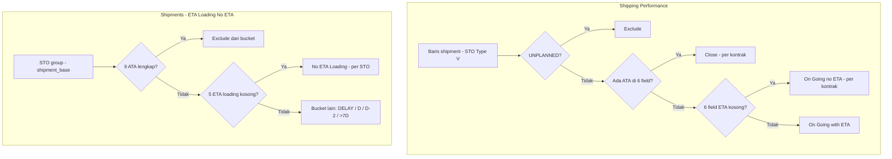

# Analisis: Perbandingan “No ETA” — Shipping Performance vs Shipments

Dokumen ini merangkum perbedaan logika perhitungan **no ETA** antara halaman **Shipping Performance** (`/shipping-performance`) dan **Shipments** (`/shipments`), serta implikasi terhadap angka yang tampil di UI.

**Tanggal analisis:** Juni 2026

---

## 1. Ringkasan eksekutif

Kedua halaman memakai label **“No ETA”**, tetapi **bukan metrik yang sama**. Angka di kedua halaman **tidak wajib selaras** — perbedaan angka sering **valid** menurut definisi masing-masing.

| Aspek | Shipping Performance — **On Going (no ETA)** | Shipments — **No ETA (Loading)** |
|-------|---------------------------------------------|----------------------------------|
| **Unit hitung** | **Kontrak** (unik `contract_number`) | **STO group** / baris `shipment_base` |
| **Dimensi ETA** | Loading + discharge (**6 field**) | **Hanya loading** (**5 field**); discharge terpisah |
| **Syarat ATA** | Kontrak **ditolak** jika ada **satu saja** ATA | Keluar bucket hanya jika **9 ATA** lengkap |
| **UNPLANNED** | **Di-exclude** dari semua section | Tidak di-exclude khusus untuk bucket no ETA |
| **Filter SAP** | STO Type **V** | STO Type **V** |
| **Tujuan bisnis** | Monitoring performa kontrak ongoing tanpa jadwal | Operasional ETA loading per STO/vessel |

---

## 2. Shipping Performance — On Going (no ETA)

### 2.1 Apa yang dihitung?

**Jumlah kontrak unik** yang memenuhi:

1. Ada minimal 1 baris shipment dalam scope halaman
2. **Belum ada ATA** di kontrak (`!hasAtaRow`)
3. Minimal 1 baris shipment **tanpa ETA** (`hasOpenNoEtaRow`)

Sumber: `frontend/src/app/shipping-performance/page.tsx` — `contractMatchesPerfCard`, `getContractActivityByContract`.

```typescript
// On Going (no ETA): at least one open shipment without ETA, no ATA on contract
return acc.hasOpenNoEtaRow && !hasAtaRow
```

Kartu menampilkan:

- **Total Vessels** — vessel unik dalam scope kartu
- **Contracts** — kontrak unik (`contractCount`)

### 2.2 Kapan baris dianggap “punya ETA”?

Fungsi `rowHasEta()` — **6 field** (prioritas dari `vessel_loading_ports`, fallback shipment):

| Loading | Discharge |
|---------|-----------|
| `loading_eta_arrival` | `discharge_eta_arrival` |
| `loading_eta_berthed` | `discharge_eta_berthed` |
| `loading_eta_completed` | `discharge_eta_completed` |

**Tidak dicek:** `eta_loading_start`, `eta_sailed` (field yang dipakai halaman Shipments untuk bucket loading).

Backend SQL (`shippingPerformance.service.ts`):

```sql
COALESCE(lp.load_eta_arrival, s.eta_arrival) AS loading_eta_arrival
COALESCE(lp.load_eta_berthed, s.eta_berthed) AS loading_eta_berthed
COALESCE(lp.load_eta_completed, s.eta_loading_complete) AS loading_eta_completed
-- + discharge dari discharge_port CTE
```

### 2.3 Kapan baris/kontrak dianggap “punya ATA”?

Fungsi `rowHasAta()` — **salah satu** dari 6 field ATA terisi → kontrak masuk **Close**, bukan no ETA:

- `loading_ata_arrival`, `loading_ata_berthed`, `loading_ata_completed`
- `discharge_ata_arrival`, `discharge_ata_berthed`, `discharge_ata_completed`

Agregasi per kontrak (prioritas):

```
if (rowHasAta) → hasAtaRow = true
else if (rowHasEta) → hasOpenEtaRow = true
else → hasOpenNoEtaRow = true
```

Jika kontrak punya 2 shipment: satu ada ATA, satu tanpa ETA → kontrak masuk **Close**, bukan no ETA.

### 2.4 Filter scope halaman

| Filter | Detail |
|--------|--------|
| Transport | SEA / MIX |
| SAP | STO Type = **V** (`buildSapStoTypeVExistsSql`) |
| Status | Exclude `UNPLANNED` (`excludeUnplannedShippingRows`) |
| Toolbar | Contract date, product, plant, incoterm, vessel, status shipment, search |

---

## 3. Shipments — No ETA (ETA Loading Status)

### 3.1 Apa yang dihitung?

**Jumlah STO group** (bukan kontrak) dengan **semua ETA loading kosong**.

Section 1 kartu **No ETA** under **ETA Loading Status**:

- Primary: `shipmentsSummary.etaLoading.noEta` dari API backend (full scope toolbar, debounced)
- Fallback: `etaLoadingBuckets.counts.noEta` dari client (halaman saat ini)

### 3.2 Field ETA loading (5 field)

Backend `loading_no_eta` (`shipment.controller.ts`):

```sql
f.eta_arrival IS NULL
AND f.eta_berthed IS NULL
AND f.eta_loading_start IS NULL
AND f.eta_loading_complete IS NULL
AND f.eta_sailed IS NULL
```

**Discharge diabaikan** untuk bucket loading. Ada section terpisah: **ETA Discharge Status → No ETA** (4 field discharge).

### 3.3 Syarat ATA (exclude dari bucket)

Baru **keluar** bucket no ETA jika **9 milestone ATA** loading + discharge **semua** terisi (`ataCompleted` di `shipmentListFilters.ts`):

- 5 ATA loading port
- 4 ATA discharge port

Kontrak dengan **1 ATA parsial** (mis. hanya arrival loading) → **masih bisa** masuk **No ETA Loading**.

Client fallback (`etaLoadingBuckets`) hanya skip `status === 'COMPLETED'` — sedikit lebih longgar vs backend.

### 3.4 Grouping

Baris di-group per **STO key**:

```
sto_number → operation_id → shipment_id → id
```

Satu kontrak dengan 2 STO tanpa ETA → dihitung **2** di Shipments, **1** kontrak di Shipping Performance.

### 3.5 Filter scope halaman

| Filter | Detail |
|--------|--------|
| SAP | STO Type = **V** |
| Toolbar | Contract date, plant, product, incoterm, search, late indicator, dll. |
| Kartu | Status vs ETA Loading vs ETA Discharge **saling eksklusif** |

Summary Section 1 ETA cards: scope toolbar saja — **tidak** narrow by status/ETA card selection (sama seperti status summary).

---

## 4. Perbedaan logika utama

### 4.1 Unit hitung: kontrak vs STO

| Situasi | Shipping Performance | Shipments (Loading No ETA) |
|---------|---------------------|----------------------------|
| 1 kontrak, 2 STO tanpa ETA | **1** kontrak | **2** STO group |
| 2 kontrak, 1 STO shared | **2** kontrak | **1** STO group |

### 4.2 Field ETA berbeda

| Situasi | Shipping Performance | Shipments (Loading) |
|---------|---------------------|---------------------|
| Hanya `eta_sailed` terisi | **No ETA** (field tidak dicek) | **Bukan** no ETA |
| Hanya `eta_loading_start` terisi | **No ETA** | **Bukan** no ETA |
| Hanya discharge ETA terisi | **With ETA** | **No ETA** (loading) |
| Loading kosong, discharge kosong | **No ETA** | **No ETA** (loading) |

### 4.3 Aturan ATA berbeda (penyebab selisih paling besar)

| Situasi | Shipping Performance | Shipments |
|---------|---------------------|-----------|
| Sudah ada ATA arrival loading, ETA loading kosong | **Close** (bukan no ETA) | Masih **No ETA Loading** |
| Semua 9 ATA lengkap | **Close** | Keluar bucket no ETA |
| Partial ATA (1–8 milestone) | **Close** jika ada di 6 field ATA yang dicek | Masih bisa **No ETA** |

Shipping Performance **lebih ketat** soal ATA: **any ATA** → kontrak keluar dari On Going (no ETA).

### 4.4 Status UNPLANNED

| Halaman | Perilaku |
|---------|----------|
| Shipping Performance | Baris `UNPLANNED` **tidak masuk** perhitungan |
| Shipments | Bisa masuk no ETA jika 5 ETA loading kosong dan belum 9 ATA lengkap |

### 4.5 Partisi kartu

**Shipping Performance** — 3 kartu kontrak-level:

- On Going (with ETA)
- On Going (no ETA)
- Close (ada ATA)

**Shipments** — 2 dimensi terpisah:

- **ETA Loading Status** (5 bucket termasuk No ETA)
- **ETA Discharge Status** (5 bucket termasuk No ETA)
- **Status** (Planned, In Progress, …) — mutually exclusive dengan kartu ETA

---

## 5. Diagram alur keputusan



---

## 6. Contoh konkret

### Contoh A — Partial ATA loading

- Loading ETA: semua kosong
- ATA arrival loading: **sudah terisi**

| Halaman | Hasil |
|---------|--------|
| Shipping Performance | **Close** — bukan no ETA |
| Shipments No ETA Loading | **Masuk** no ETA |

### Contoh B — Hanya `eta_sailed` terisi

| Halaman | Hasil |
|---------|--------|
| Shipping Performance | **No ETA** |
| Shipments | **Bukan** no ETA loading |

### Contoh C — Discharge ETA terisi, loading kosong

| Halaman | Hasil |
|---------|--------|
| Shipping Performance | **With ETA** |
| Shipments Loading | **No ETA** |

### Contoh D — 1 kontrak, 2 STO, keduanya tanpa ETA, tanpa ATA

| Halaman | Hasil |
|---------|--------|
| Shipping Performance | **1** kontrak |
| Shipments | **2** (STO group) |

---

## 7. Relasi dengan analisis kontrak “without shipment”

Metrik ini **hanya berlaku untuk kontrak/shipment yang sudah ada** di tabel `shipments`.

- **153 SEA without shipments** (Contracts) → **tidak masuk** perhitungan no ETA di kedua halaman
- **9 Contract On Going no ETA** (Shipping Performance) → subset kecil dari kontrak **yang sudah punya shipment**, ongoing, tanpa ATA, tanpa 6 field ETA

Lihat juga: [`ANALISIS-KONTRAK-SHIPMENT-VS-SHIPPING-PERFORMANCE.md`](./ANALISIS-KONTRAK-SHIPMENT-VS-SHIPPING-PERFORMANCE.md)

---

## 8. Query verifikasi (staging)

Gunakan **filter toolbar yang sama** (contract date, plant, product) saat membandingkan angka UI vs SQL.

### 8.1 Shipping Performance style (kontrak, 6 ETA, no ATA)

```sql
-- Sesuaikan filter date/plant; STO Type V perlu dicek terpisah jika diperlukan
SELECT COUNT(DISTINCT c.contract_id) AS sp_ongoing_no_eta_contracts
FROM shipments s
INNER JOIN contracts c ON c.id = s.contract_id
LEFT JOIN LATERAL (
  SELECT
    vlp.eta_vessel_arrival::date AS load_eta_arrival,
    vlp.eta_vessel_berthed_at_loading_port::date AS load_eta_berthed,
    vlp.eta_loading_completed::date AS load_eta_completed,
    vlp.ata_vessel_arrival::date AS load_ata_arrival,
    vlp.ata_vessel_berthed::date AS load_ata_berthed,
    vlp.ata_loading_completed::date AS load_ata_completed
  FROM vessel_loading_ports vlp
  WHERE vlp.shipment_id = s.id AND COALESCE(vlp.is_discharge_port, false) = false
  ORDER BY vlp.port_sequence NULLS LAST, vlp.id
  LIMIT 1
) lp ON true
LEFT JOIN LATERAL (
  SELECT
    vlp.eta_vessel_arrive_at_discharge_port::date AS discharge_eta_arrival,
    vlp.eta_vessel_berthed_at_discharge_port::date AS discharge_eta_berthed,
    vlp.eta_vessel_complete_discharge::date AS discharge_eta_completed,
    vlp.ata_vessel_arrival::date AS discharge_ata_arrival,
    vlp.ata_vessel_berthed::date AS discharge_ata_berthed,
    vlp.ata_loading_completed::date AS discharge_ata_completed
  FROM vessel_loading_ports vlp
  WHERE vlp.shipment_id = s.id AND COALESCE(vlp.is_discharge_port, false) = true
  ORDER BY vlp.port_sequence NULLS LAST, vlp.id
  LIMIT 1
) dp ON true
WHERE UPPER(COALESCE(NULLIF(TRIM(c.transport_mode), ''), 'SEA')) IN ('SEA', 'MIX')
  AND UPPER(COALESCE(s.status, '')) <> 'UNPLANNED'
  -- No ATA (6 fields - mirrors rowHasAta)
  AND COALESCE(lp.load_ata_arrival, s.ata_arrival) IS NULL
  AND COALESCE(lp.load_ata_berthed, s.ata_berthed) IS NULL
  AND COALESCE(lp.load_ata_completed, s.ata_loading_complete) IS NULL
  AND COALESCE(dp.discharge_ata_arrival, s.ata_discharge_arrival) IS NULL
  AND COALESCE(dp.discharge_ata_berthed, s.ata_discharge_berthed) IS NULL
  AND COALESCE(dp.discharge_ata_completed, s.ata_discharge_complete) IS NULL
  -- No ETA (6 fields - mirrors rowHasEta)
  AND COALESCE(lp.load_eta_arrival, s.eta_arrival) IS NULL
  AND COALESCE(lp.load_eta_berthed, s.eta_berthed) IS NULL
  AND COALESCE(lp.load_eta_completed, s.eta_loading_complete) IS NULL
  AND COALESCE(dp.discharge_eta_arrival, s.eta_discharge_arrival) IS NULL
  AND COALESCE(dp.discharge_eta_berthed, s.eta_discharge_berthed) IS NULL
  AND COALESCE(dp.discharge_eta_completed, s.eta_discharge_complete) IS NULL;
```

### 8.2 Shipments style (STO group, 5 loading ETA)

Ambil dari API summary:

```
GET /shipments?summaryOnly=true&...toolbar params...
→ data.summary.etaLoading.noEta
```

Atau gunakan logika `loading_no_eta` pada CTE `shipment_base` + `enriched` di `shipment.controller.ts`.

---

## 9. Apakah perbedaan angka valid?

| Pertanyaan | Jawaban |
|------------|---------|
| Haruskah angka no ETA sama antar halaman? | **Tidak** — definisi berbeda by design |
| Apakah ini bug? | **Belum tentu** — inkonsistensi definisi bisnis, bukan necessarily bug teknis |
| Mana yang biasanya lebih kecil? | Shipping Performance (kontrak + any ATA exclude + 6 field ETA) |
| Kapan perlu harmonisasi? | Jika requirement bisnis mensyaratkan **angka comparable** antar halaman |

---

## 10. Rekomendasi harmonisasi (opsional)

Jika stakeholder ingin angka selaras, pertimbangkan:

| Area | Opsi harmonisasi |
|------|------------------|
| Unit hitung | Samakan ke **kontrak** atau **STO** di kedua halaman |
| Field ETA | Satu daftar field ETA loading + discharge yang shared |
| ATA threshold | Pilih: **any ATA** vs **9 ATA lengkap** — terapkan konsisten |
| UNPLANNED | Exclude atau include di kedua halaman |
| Label UI | Ubah label agar eksplisit: *“No ETA (6 milestones)”* vs *“No ETA Loading (5 fields)”* |

---

## 11. Referensi kode

| Area | Path |
|------|------|
| Shipping Perf — kartu no ETA | `frontend/src/app/shipping-performance/page.tsx` — `rowHasEta`, `rowHasAta`, `contractMatchesPerfCard` |
| Shipping Perf — SQL rows | `backend/src/services/shippingPerformance.service.ts` |
| Shipments — ETA loading buckets (client) | `frontend/src/app/shipments/page.tsx` — `etaLoadingBuckets` |
| Shipments — summary backend | `backend/src/controllers/shipment.controller.ts` — `loading_no_eta`, `eta_loading_no_eta` |
| Shipments — filter ETA bucket | `backend/src/utils/shipmentListFilters.ts` — `appendShipmentEtaBucketFilters` |
| SAP STO Type V | `backend/src/utils/shipmentStoTypeSql.ts` |
| Status derive / effective status | `backend/src/utils/shipmentListFilters.ts` — `shipmentEffectiveStatusExpr` |

---

## 12. Checklist investigasi selisih angka

- [ ] Filter contract date / plant / product / incoterm **sama** di kedua halaman?
- [ ] Membandingkan **kontrak** (SP) vs **STO group** (Shipments)?
- [ ] Membandingkan **On Going no ETA** (SP) vs **No ETA Loading** (Shipments), bukan discharge?
- [ ] Ada kontrak dengan **partial ATA**? → biasanya masuk SP Close, masih Shipments no ETA
- [ ] Ada shipment **UNPLANNED**? → hanya memengaruhi SP
- [ ] Hard refresh / deploy FE setelah fix race condition Shipments?

---

*Dokumen ini dibuat dari analisis perbandingan no ETA Shipping Performance vs Shipments — Juni 2026.*
