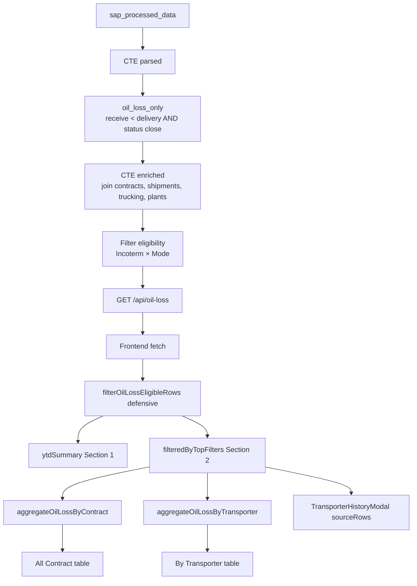

# Oil Loss — Dokumentasi Halaman & Logic

**KLIP (KPN Logistics Intelligence Platform)**  
Versi dokumen: 2.0 | Diperbarui: 2026-06-09  
Route frontend: `/oil-loss`  
API: `GET /api/oil-loss`

> Dokumen ini mendeskripsikan **implementasi terkini** halaman Oil Loss (logic bisnis, sumber data, kalkulasi, dan UX).  
> PRD awal: [`PRD - Oil Loss.md`](./PRD%20-%20Oil%20Loss.md) (beberapa bagian sudah tidak sesuai UI terbaru).

---

## 1. Ringkasan

Halaman Oil Loss menampilkan kontrak dengan **kehilangan minyak** (Qty Receive < Qty Delivery) yang memenuhi aturan eligibility Incoterm × Mode, dengan status **close**. Data bersumber dari **SAP Processed Data**, diperkaya dengan kontrak, shipment, trucking, dan master plant.

Halaman terdiri dari **3 section**:

| Section | Judul | Fungsi |
|---------|-------|--------|
| **1** | Year-to-Date (YTD) Oil Loss Summary | Kartu R1–R4 (rata-rata oil loss MT & %) — **tidak** terpengaruh filter toolbar tabel |
| **2** | Filter | Incoterm → Product → Group Plant, search, rentang Contract Date |
| **3** | View Table | Toggle **All Contract** / **By Transporter**, tabel kompak + pagination |

---

## 2. Peta File Penting

### Backend

| File | Peran |
|------|-------|
| `backend/src/controllers/oilLoss.controller.ts` | Handler `GET /api/oil-loss` |
| `backend/src/routes/oilLoss.routes.ts` | Route + auth |
| `backend/src/utils/oilLossQuerySql.ts` | SQL utama + lookup CTE |
| `backend/src/utils/oilLossSapSql.ts` | Ekspresi field SAP (qty, SFAL, SFBD) |
| `backend/src/utils/oilLossEligibility.ts` | Filter Incoterm × Mode (global) |
| `backend/src/utils/oilLossSummary.ts` | Kalkulasi YTD R1–R4 |

### Frontend

| File | Peran |
|------|-------|
| `frontend/src/app/oil-loss/page.tsx` | Halaman utama (3 section) |
| `frontend/src/lib/oilLossAllContractColumns.ts` | Kolom & agregasi **All Contract** |
| `frontend/src/lib/oilLossByTransporterColumns.ts` | Kolom & agregasi **By Transporter** |
| `frontend/src/lib/oilLossEligibility.ts` | Filter defensif pasca-fetch (mirror backend) |
| `frontend/src/lib/oilLossFormat.ts` | Format tampilan Oil Loss (2 desimal) |
| `frontend/src/lib/oilLossTransporterPartition.ts` | Partisi Open/Close di modal |
| `frontend/src/components/oil-loss/TransporterHistoryModal.tsx` | Modal detail transporter |
| `frontend/src/components/performance/PerformanceScopeFilters.tsx` | Filter Incoterm / Product / Group Plant |

---

## 3. Alur Data



**Prinsip:**

- Filter eligibility & kriteria oil loss diterapkan di **backend** sebelum response.
- **YTD (Section 1)** dihitung dari seluruh baris eligible di API (bukan dari filter toolbar Section 2).
- **Tabel & modal** memakai data yang sama, lalu difilter client-side oleh toolbar (incoterm, product, group plant, contract date, search).

---

## 4. Aturan Bisnis Global

### 4.1 Kriteria Oil Loss (wajib)

Baris masuk pipeline Oil Loss hanya jika **semua** kondisi terpenuhi:

| # | Kondisi |
|---|---------|
| 1 | `Quantity Receive` **<** `Quantity Delivery` (ada loss) |
| 2 | `Status` = `close` (case-insensitive) |
| 3 | Qty Delivery & Qty Receive tidak kosong dan numerik valid (regex `^[0-9.]+$` setelah hapus koma/spasi) |
| 4 | Memenuhi **eligibility Incoterm × Mode** (lihat §4.2) |

### 4.2 Eligibility Incoterm × Mode (khusus halaman Oil Loss)

Hanya kombinasi berikut yang **diizinkan**. Sisanya **dikecualikan** (tidak mempengaruhi Contract / Shipment / Trucking).

| Rule | Incoterm | Mode (`SEA / LAND` dari SAP) |
|------|----------|------------------------------|
| 1 | **CIF** | `LAND`, `MIX` |
| 2 | **FOB** | `SEA`, `LAND`, `MIX` |
| 3 | **LCO** | `SEA`, `LAND`, `MIX` |

**Normalisasi:**

- Incoterm: `UPPER(TRIM(...))` — prioritas dari tabel `contracts`, fallback SAP raw `Incoterm`.
- Mode: `UPPER(TRIM(...))`; jika kosong → default **`LAND`**.
- Perbandingan **case-insensitive**.

**Implementasi:**

- Backend: `OIL_LOSS_ELIGIBILITY_WHERE_SQL` di `oilLossQuerySql.ts`
- Frontend cadangan: `filterOilLossEligibleRows()` di `oil-loss/page.tsx`

### 4.3 Rumus Oil Loss (baris & tabel)

| Field | Formula | Satuan penyimpanan | Tampilan UI |
|-------|---------|-------------------|-------------|
| **Oil Loss (Kg)** | `Qty Receive − Qty Delivery` | Kg (negatif = loss) | MT, **2 desimal** |
| **Oil Loss %** | `(Qty Receive − Qty Delivery) ÷ Qty Delivery × 100` | % (4 desimal internal) | %, **2 desimal** |

Tooltip kolom (via `FieldHelp`):

- **Oil Loss (MT):** `Qty Receive − Qty Delivery` (dalam MT)
- **Oil Loss %:** `(Qty Receive − Qty Delivery) ÷ Qty Delivery × 100%`

---

## 5. Sumber Data & Enrichment

### 5.1 Quantity (wajib dari SAP)

| Field UI | Sumber | Field SAP (`data->'raw'`) |
|----------|--------|---------------------------|
| Qty Delivery | `sap_processed_data` saja | `Quantity Delivered` → `Quantity Delivery` → `Qty Deliver` |
| Qty Receive | `sap_processed_data` saja | `Quantity Receive` → `Qty Receive` |

Tidak diambil dari tabel `shipments` atau `trucking_operations`.

### 5.2 SFAL / SFBD

| Prioritas | Sumber |
|-----------|--------|
| 1 | SAP raw: `Ship Figure After Loading (SFAL)` / `Ship Figure Before Discharge (SFBD)` |
| 2 (fallback) | `shipments.sfal_qty` / `shipments.sfbd_qty` (Kg), match via STO atau contract |

### 5.3 Enrichment lain

| Field | Sumber |
|-------|--------|
| Contract Date | `contracts.contract_date` → fallback SAP `Contract Date` |
| Incoterm | `contracts.incoterm` → fallback SAP `Incoterm` |
| Group Plant | `master_plants` via `plant_code` + `company_name` |
| Qty Contract | `contracts.quantity_ordered` → fallback SAP contract qty |
| Transporter | SEA: trucking → vessel owner → SAP trucking owner; LAND: trucking → SAP trucking owner |
| Loading / Unloading Location | trucking → fallback SAP truck fields |

---

## 6. API `GET /api/oil-loss`

**Auth:** Bearer JWT (`authenticateToken`)

**Response:**

```json
{
  "data": [ /* baris eligible, sudah terfilter §4 */ ],
  "ytdSummary": {
    "year": 2026,
    "dateFrom": "2026-01-01",
    "dateTo": "2026-06-09",
    "r1": { "avgMt": -1.23, "avgPct": -0.45, "sampleCount": 120 },
    "r2": { "avgMt": null, "avgPct": null, "sampleCount": 0 },
    "r3": { ... },
    "r4": { ... }
  },
  "gainSummary": { "totalGainKg": 0, "gainCount": 0 },
  "dataSources": {
    "quantityDelivery": "sap_processed_data",
    "quantityReceive": "sap_processed_data",
    "quantitySfal": "sap_processed_data|shipments.sfal_qty",
    "quantitySfbd": "sap_processed_data|shipments.sfbd_qty"
  }
}
```

`gainSummary` dihitung terpisah (kontrak close dengan receive > delivery); **tidak ditampilkan** di UI Section 1 saat ini.

---

## 7. Section 1 — YTD Oil Loss Summary (R1–R4)

**Judul:** `Year-to-Date (YTD) Oil Loss Summary`

**Rentang YTD:** 1 Januari tahun berjalan → hari ini (`contract_date` atau `operation_date`).

**Independen** dari filter Section 2 (incoterm, product, group plant, search, date toolbar).

### Kartu R1–R4

| Kartu | Formula loss (Kg) | Basis % |
|-------|-------------------|---------|
| **R1** | `Qty SFAL − Qty Delivery` | Qty Delivery |
| **R2** | `Qty SFBD − Qty SFAL` | Qty SFAL |
| **R3** | `Qty Receive − Qty SFBD` | Qty SFBD |
| **R4** | `Qty Receive − Qty Delivery` | Qty Delivery |

Setiap kartu menampilkan:

- **Avg Oil Loss (MT)** — rata-rata loss per sampel ÷ 1000, **2 desimal**
- **Avg Oil Loss (%)** — rata-rata persentase per sampel, **2 desimal**

Baris tanpa qty yang dibutuhkan untuk formula kartu tersebut di-skip (`sampleCount` tidak bertambah).

---

## 8. Section 2 — Filter Toolbar

Menggunakan `PerformanceScopeFilters` (selaras Shipment / Trucking / Contract):

| Filter | Dampak |
|--------|--------|
| **Incoterm** | Multi-select |
| **Product** | Multi-select; default dari user scope (`useUserScopeFilterDefaults('oil-loss')`) |
| **Group Plant** | Multi-select; default dari user scope |
| **Search** | Teks bebas (field berbeda per view — lihat §9) |
| **Contract Date From / To** | Filter `contract_date` / `operation_date`; default: 1 Jan tahun ini → hari ini |

Filter diterapkan di `filteredByTopFilters` **setelah** fetch API. **Tidak** mengubah YTD Section 1.

---

## 9. Section 3 — View Table

### 9.1 Fitur umum (kedua view)

- Tabel kompak operasional (`klip-compact-table--operational`)
- Skeleton loading, empty state, pagination (20 baris/halaman)
- Column toggler + drag-reorder header (preferensi per view di `localStorage`)
- Default sort:
  - **All Contract:** `contract_date` DESC
  - **By Transporter:** `transporter` ASC
- Qty ditampilkan dalam **MT** (data disimpan Kg)
- Oil Loss MT & %: **2 desimal**, warna merah (loss) / hijau (gain)

### 9.2 View: All Contract

**Agregasi:** per `contract_number` (fallback `contract_ext_no`, lalu `row.id`).

**Kolom default (urutan kiri→kanan):**

| Kolom | Catatan render |
|-------|----------------|
| Contract Date | Format D/M/Y |
| Contract Ext No | Stacked jika ada koma |
| PO | Stacked comma |
| STO | Stacked comma |
| Product | Truncate + tooltip |
| Incoterm | Truncate + tooltip |
| Qty Contract | MT |
| Qty Delivery | MT (Contracts View Table / qty_move + UAT) |
| Qty Received | MT (Contracts View Table / qty_move) |
| Oil Loss (MT) | 2 desimal |
| Oil Loss % | 2 desimal |
| Status | Badge |

**Search:** contract ext no, contract no, PO, STO, product, supplier, incoterm.

### 9.3 View: By Transporter

**Agregasi:** per nama transporter (case-insensitive key); qty dijumlahkan.

**Kolom default:**

| Kolom | Catatan |
|-------|---------|
| Transporter | **Klik** → buka modal (link biru) |
| Qty Contract | MT, dijumlahkan |
| Qty Delivery | MT |
| Qty Receive | MT |
| Oil Loss (MT) | 2 desimal |
| Oil Loss % | 2 desimal |

Kolom tersembunyi (opsional via column toggler): Loading/Unloading Location, Contract Ext No, STO, dll.

**Search:** nama transporter saja.

### 9.4 Render sel khusus

| Tipe | Perilaku |
|------|----------|
| Comma-separated (PO, STO, Contract Ext No) | `OperationalStackedCommaCell` — satu nilai per baris |
| Teks panjang (Product, Incoterm, Transporter di kolom non-link) | `OperationalTruncatedCell` — max 200px, ellipsis, `title` tooltip |

---

## 10. Transporter Modal

**Pemicu:** klik nama transporter di view By Transporter.  
**UX:** mengikuti pola **Vessel Modal** (Shipping Performance).

### Header

- Nama transporter
- Ringkasan: jumlah on going · close · total in scope

### Section 1 — Summary

| Item | Sumber |
|------|--------|
| Loading Location | Daftar unik (dari agregasi transporter) |
| Unloading Location | Daftar unik |
| Oil Loss (MT) & Oil Loss (%) | Total agregat baris transporter yang diklik |

### Section 2 — On Going Contract

Status: `open`, `in progress`, `in_progress`

### Section 3 — Close Contract

Status: `close`, `closed`, `completed`

**Kolom tabel modal:** Contract Date | Contract Ext No | PO | STO | Qty Delivery | Qty Received | Oil Loss (MT) | Oil Loss % | Status

**Sumber baris modal:** `filteredByTopFilters` (toolbar scope) difilter per `transporterKey`.

> **Catatan data:** API utama saat ini hanya mengembalikan baris **status close** dengan loss. Tabel **On Going** biasanya kosong sampai sumber data diperluas.

---

## 11. Agregasi Client-Side

### All Contract (`aggregateOilLossByContract`)

- Group key: `contract_number` → `contract_ext_no` → `row.id`
- Qty Delivery & Received: **Contracts View Table formula** (API overlays `qty_move` + UAT); when merging SPD rows for the same contract, **take once** (do not sum)
- Qty Contract: **MAX** per merge (bukan sum)
- Oil Loss: dihitung ulang dari total delivery/received
- Token multi-nilai (PO, STO): digabung unik dipisah koma

### By Transporter (`aggregateOilLossByTransporter`)

- Group key: `LOWER(TRIM(transporter))`
- Qty Contract, Delivery, Received: **dijumlahkan sekali per contract** (bukan per baris SPD)
- Loading/Unloading: merge token unik
- Oil Loss: dihitung ulang dari total

---

## 12. Scope Isolation

| Halaman | Terpengaruh filter eligibility Oil Loss? |
|---------|------------------------------------------|
| **Oil Loss** (`/oil-loss`) | ✅ Ya |
| Contracts | ❌ Tidak |
| Shipments | ❌ Tidak |
| Trucking | ❌ Tidak |
| Shipping Performance | ❌ Tidak |

---

## 13. LocalStorage Keys

| Key | View |
|-----|------|
| `oil-loss.all-contract.visibleColumns` | All Contract |
| `oil-loss.all-contract.columnOrder` | All Contract |
| `oil-loss.all-contract.compact.columnLayoutVersion` | Versi layout (`oil-loss-all-contract-v1`) |
| `oil-loss.by-transporter.visibleColumns` | By Transporter |
| `oil-loss.by-transporter.columnOrder` | By Transporter |
| `oil-loss.by-transporter.compact.columnLayoutVersion` | Versi layout (`oil-loss-by-transporter-v2`) |

Perubahan versi layout mereset preferensi kolom ke default.

---

## 14. Perbedaan dengan PRD v1.0

| Aspek | PRD lama | Implementasi saat ini |
|-------|----------|----------------------|
| Section 1 | 5 KPI cards + drilldown hierarki | 4 kartu YTD R1–R4 |
| Filter | Mode, Product, Plant/Site | Incoterm, Product, Group Plant |
| Tabel | Satu tabel flat | Toggle All Contract / By Transporter |
| Eligibility | Tidak ada | CIF/FOB/LCO × Mode rules |
| Qty | Kg di UI | MT di UI (simpan Kg) |
| Modal | Tidak ada | Transporter Modal |

---

## 15. Checklist Developer

- [ ] Setelah ubah SQL eligibility → restart backend
- [ ] Setelah ubah kolom default By Transporter → bump `OIL_LOSS_BY_TRANSPORTER_COLUMN_LAYOUT_VERSION`
- [ ] Unit test eligibility: `backend/src/utils/oilLossEligibility.test.ts`
- [ ] Oil Loss format: selalu 2 desimal via `oilLossFormat.ts`
